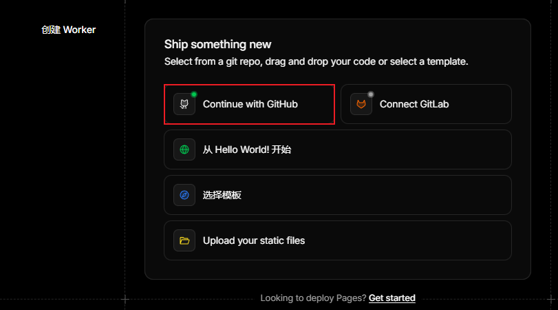
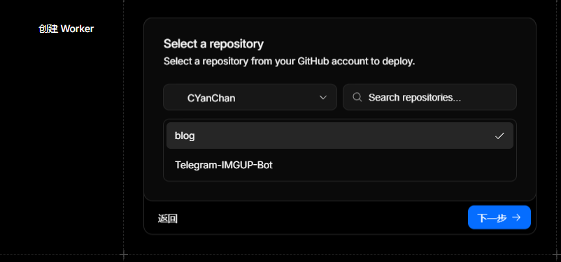
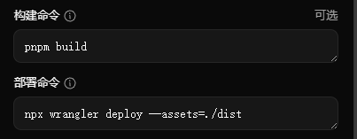
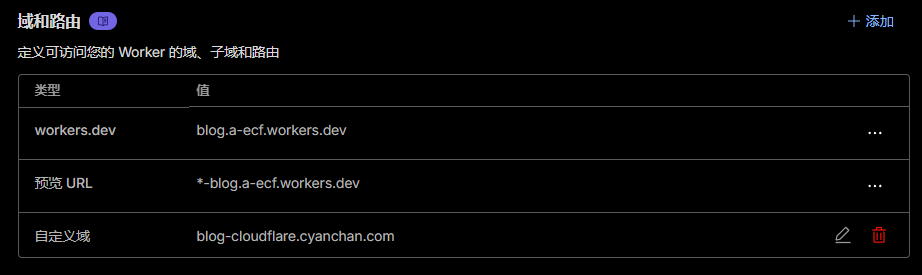

## Cloudflare
前往Cloudflare的 Workers 和 Pages 页面，创建一个新Pages


构建命令：`pnpm build`    
部署命令：`npx wrangler deploy --assets=./dist`    

如果卡在最后一步无法部署，就在根目录新建一个 `wrangler.toml` 并推送到仓库中    
```js title="wrangler.toml"
name = "blog" # Pages项目名
compatibility_date = "2025-11-12" # 当前日期
```
构建完成后打开页面即可，你也可以添加一个自定义域
