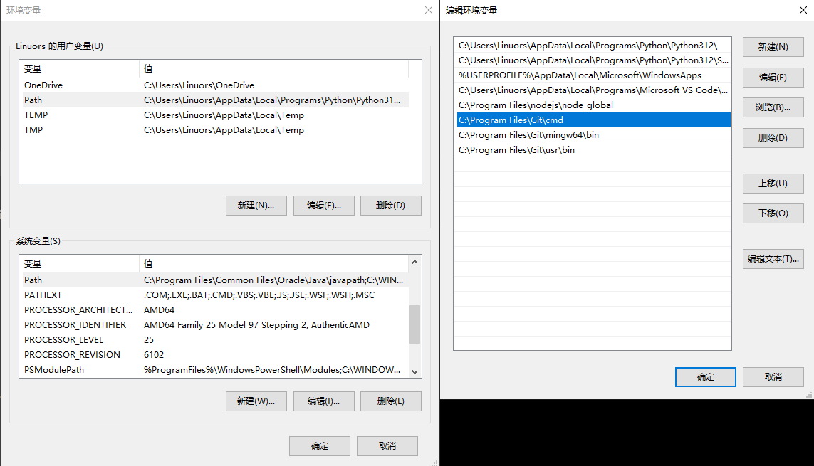

## 安装Git
[Git - Install for Windows](https://git-scm.com/install/windows)
下载最新版本的 Standalone Installer ，无脑默认 Next 即可    
安装完后可以把默认添加的系统变量Path复制到用户变量Path中，不然Windows CMD可能无法直接使用 git 命令    

## 设置Git
Github新建仓库后，在CMD中设置目标地址和推送方式    
### HTTPS
最简单的方法    
```bash
git remote set-url origin https://github.com/CYanChan/blog.git
git push -u origin master
```
然后会要你输入GitHub凭据：    
- 用户名：GitHub用户名
- 密码：**Personal Access Token**（不是GitHub登录密码）
  - 到 GitHub → Settings → Developer settings → Personal access tokens
  - 生成新的token，勾选repo权限
### SSH
麻烦一点，但是配置完之后就不用每次都输入密码了    
#### 1、检查当前ssh秘钥    
```bash
ls -al ~/.ssh
```
如果没有 id_rsa和 id_rsa.pub或 id_ed25519和 id_ed25519.pub 这些文件则创建一个    
```bash
ssh-keygen -t ed25519 -C "your_email@example.com"
```
按Enter接受默认保存路径，可选设置密码    
#### 2、上传公钥至Github
复制公钥内容    
```bash
cat ~/.ssh/id_ed25519.pub
```
添加到GitHub    
- 登录GitHub → Settings → SSH and GPG keys
- 点击"New SSH key"
- 粘贴公钥内容，设置标题并保存
#### 3、测试ssh连接
```bash
C:\Users\Linuors\Desktop\Blog>ssh -T git@github.com
Hi CYanChan! You've successfully authenticated, but GitHub does not provide shell access.
```
## 推送文件到仓库
先确认远程仓库URL是否正确    
```bash
C:\Users\Linuors\Desktop\Blog>git remote -v
origin  git@github.com:CYanChan/blog.git (fetch)
origin  git@github.com:CYanChan/blog.git (push)
```
然后推送即可    
```bash
git status
git add .
git commit -m "提交说明"
git push -u origin master
```